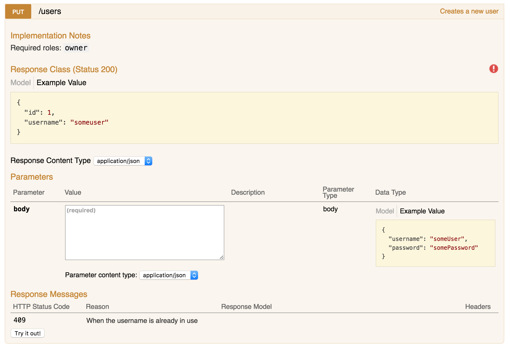

+++
title="Generating Swagger documentation for an Express API"
date=2016-10-15
+++

In the process of finishing up an [Express](https://expressjs.com/) project, I
wanted to leave a nice set of documentation for future users and/or maintainers
of the API. I wanted the documentation to live next to the code, and the tooling
to generate a nice site from it. Finally I settled for
[Swagger](http://swagger.io/) and used a combination of packages to get the job
done.

There were several things I was expecting from the documentation:

- To live in comments next to the code, so it would be easier to remember to
  update it when needed.
- To generate a decent enough site for navigating it.
- To be able to test the API through that generated site.
- To support making authenticated requests.
- Avoid owning the code for the UI.

## Parsing the comments

Let's begin by being able to extract Swagger-formatted documentation from
comments in the code. The
[`swagger-jsdoc`](https://www.npmjs.com/package/swagger-jsdoc) project does
exactly that and **generates a big object containing the description of the
whole API**. The setup is fairly straightforward if we ignore Swagger specifics:

```js
const swaggerJSDoc = require("swagger-jsdoc");

const spec = swaggerJSDoc({
  swaggerDefinition: {
    info: {
      title: "Project title",
      version: "1.0.0",
    },
    produces: ["application/json"],
    consumes: ["application/json"],
    securityDefinitions: {
      jwt: {
        type: "apiKey",
        name: "Authorization",
        in: "header",
      },
    },
    security: [{ jwt: [] }],
  },
  apis: ["lib/routes/*.js"],
});
```

The generator function receives an options object with two important properties:

- `swaggerDefinition` will include Swagger's global options, which can be found
  on its [specification](http://swagger.io/specification/) under "Schema".
- `apis` contains an array of paths that `swagger-jsdoc` will try to parse.

I hadn't used Swagger before starting with this documentation, so I'll write up
about some useful properties I've been learning along the way with references to
their specs:

- `info` contains metadata about the API. Its contents are a Swagger
  [Info Object](http://swagger.io/specification/#infoObject).
- `produces` and `consumes` are array of mime types that the API responds with
  and accepts, respectively. They can be set for each endpoint, but since the
  API I'm working on uses mostly JSON it was useful to set them as a global
  default.
- `securityDefinitions` specifies the way the user has to authenticate to use
  the API. **The project uses JWT for authentication** (which I talked about in
  [a previous post](/2016/10/01/express-jwt)) so I set it up according to
  Swagger's
  [security definition](http://swagger.io/specification/#securityDefinitionsObject).
  It basically means that the API expects a key on the `Authorization` header.
- `security`, similar to `produces` and `consumes`, can be set per endpoint -
  but since most of the API requires authentication, I specify it globally and
  override it when needed. It's an array of
  [security requirements objects](http://swagger.io/specification/#securityRequirementObject)
  which for this kind of authentication means just listing the required security
  definitions.

## Writing the documentation

With that setup, the next step is to write some documentation for the endpoints.
`swagger-jsdoc` doesn't expect the comments to be placed anywhere specific, as
long as they are somewhere in the files included by the paths defined in the
`apis` option, so in this case **I want each endpoint definition to have its
documentation right above it**. Let's go with a fairly comprehensive example:

```js
/**
 * @swagger
 * /users:
 *   put:
 *     summary: Creates a new user
 *     description:
 *       "Required roles: `admin`"
 *     tags:
 *       - Users
 *     parameters:
 *       - name: body
 *         in: body
 *         required: true
 *         schema:
 *           type: object
 *           required:
 *             - username
 *             - password
 *           properties:
 *             username:
 *               type: string
 *             password:
 *               type: password
 *           example: {
 *             "username": "someUser",
 *             "password": "somePassword"
 *           }
 *     responses:
 *       200:
 *         schema:
 *           type: object
 *           properties:
 *             id:
 *               type: integer
 *             username:
 *               type: string
 *         examples:
 *           application/json: {
 *             "id": 1,
 *             "username": "someuser"
 *           }
 *       409:
 *         description: When the username is already in use
 */
router.put("/", restrictToRoles("owner"), createUser);
```

Most of the structure is self-explanatory. The YAML structure **begins with the
endpoint's route**, and includes **one or several HTTP verbs**. In this case
since I'll document each verb on a separate comment, it will always have one
verb. Then follows a short summary of the endpoint's purpose and an optional
description. I've used the `description` field to document the required roles
since Swagger only supports roles (actually scopes) properly when using OAuth
authentication. Next we assign `tags` to the endpoint, which will be used to
**group related endpoints in the UI**.

Then things get a little bit more complex.
[Parameter objects](http://swagger.io/specification/#parameterObject) in Swagger
include all parameters **from query string parameters to headers, passing
through form fields, path parameters and request bodies**. In this case, we
expect to receive the data for the new user on a JSON body. Even though there
are several fields that our endpoint needs, **they're all defined inside the
single body parameter's schema**.
[The schema object](http://swagger.io/specification/#schemaObject) is probably
the most complicated part of the Swagger spec that I had to deal with yet, but
the basics are simple enough. **You define
[a type](http://swagger.io/specification/#dataTypeFormat) for it**, and if it's
an object or an array **you include a `properties` or `items` property
respectively**, describing the shape of its elements. In this case we expect an
object with `username` and `password`. We could add a `description` field for
them but they are self explanatory.

`responses` lists the possible response codes for the endpoint, with an optional
`schema` property to describe the response format. With everything defined,
eventually our UI will look similar to this:



See that red warning sign to the right? That means that **the endpoint is
secured** (because we defined that to be the default) and clicking on it allows
us to set the `Authorization` header to **make authenticated requests** by
clicking on the "Try it out!" button. Let's see how to create that UI now.

## Generating the documentation site

[`swagger-ui-express`](https://www.npmjs.com/package/swagger-ui-express) will do
just that for us. With a very simple API, given the object with the API
definition that `swagger-jsdoc` created, it can be set up on a route and serve
that documentation:

```js
const swaggerUi = require("swagger-ui-express");

/**
 * Assuming we have a `router` here and the `spec` generated by swagger-jsdoc...
 */

router.use("/docs", swaggerUi.serve, swaggerUi.setup(spec));
```

And as simple as that, **our documentation now lives under the `/docs`
endpoint**. All the files for the site are owned by `swagger-ui-express`, so
maintainers of the project don't have to worry about keeping it updated.

I did make a little tweak to that configuration above. By default, the generated
site will show the URL of an example JSON spec on its input field at the top.
While it still works correctly, I set the route up so that it will add a query
parameter to my actual JSON spec. For the sake of consistency, I also added an
endpoint to serve the raw JSON spec:

```js
/**
 * Given `spec` and the `router`
 */
const swaggerUi = require("swagger-ui-express");

const docsJsonPath = "/api-docs.json";
const swaggerUiHandler = swaggerUi.setup(spec);

router.get(docsJsonPath, (req, res) => {
  res.setHeader("Content-Type", "application/json");
  res.send(spec);
});

router.use("/docs", swaggerUi.serve, (req, res, next) => {
  if (!req.query.url) {
    res.redirect(`/docs?url=http://${req.headers.host}${docsJsonPath}`);
  } else {
    swaggerUiHandler(req, res, next);
  }
});
```

That `url` query parameter makes the page show the given URL at the top instead
of the default. **And that's it!** The only thing left is to document every
endpoint in the API.

## Alternatives

There are two alternatives that I considered throughout the process. The first
is [apiDoc](http://apidocjs.com/), which generates the documentation from
JSDoc-looking comments. I decided against it because I had a couple of issues
with the generated site and also preferred to use something seemingly more
standard like Swagger, but it looks like an interesting project.

The other is to use
[`swagger-tools`](https://github.com/apigee-127/swagger-tools), a project
recommended by `swagger-jsdoc`, to generate the UI based on the spec. While the
project works similarly to `swagger-ui-express`, the version of the Swagger UI
it comes with is outdated and doesn't support header-based authentication. While
`swagger-ui-express`' version is also a bit outdated, it's new enough to include
it. `swagger-tools` does support defining a custom directory with a different
version of Swagger UI, but that would mean checking out the code for the UI in
version control and start owning it, which is something I wanted to avoid.

## Links

- [Swagger Specification](http://swagger.io/specification/)
- [`swagger-jsdoc`](https://www.npmjs.com/package/swagger-jsdoc)
- [`swagger-ui-express`](https://www.npmjs.com/package/swagger-ui-express)
