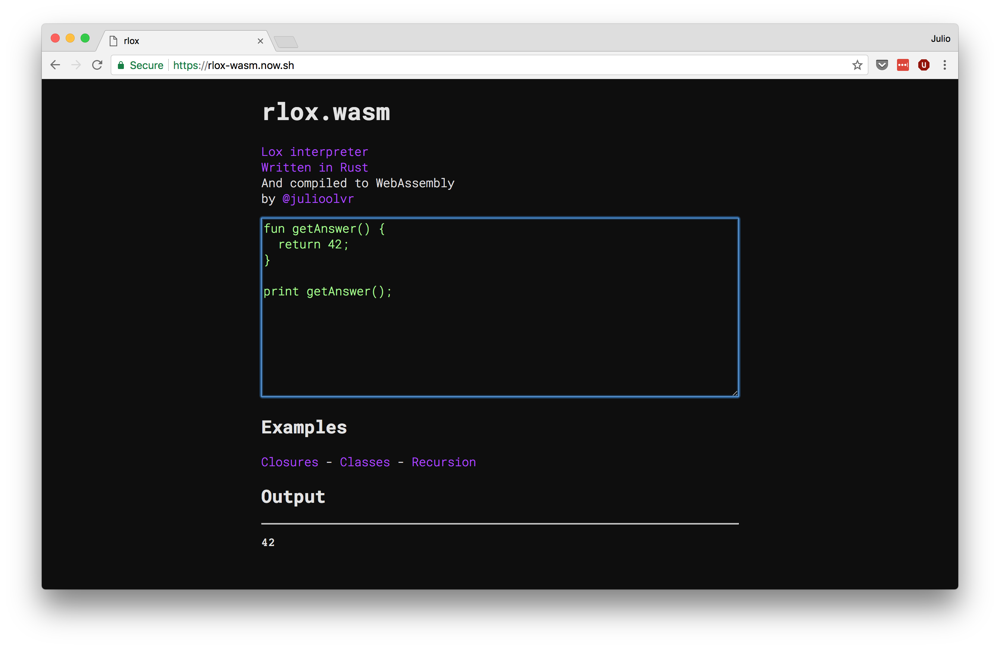
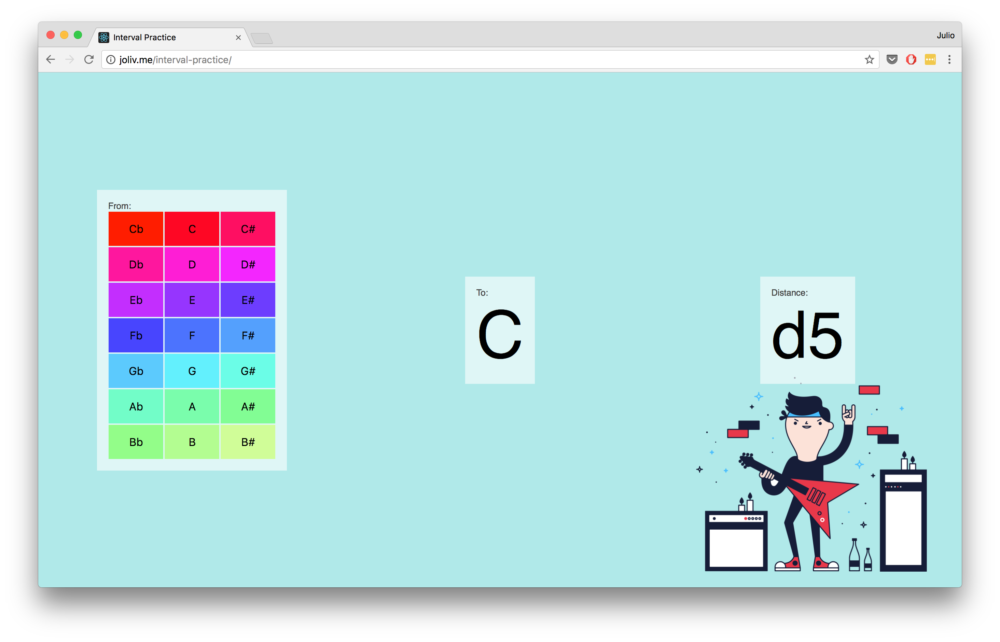
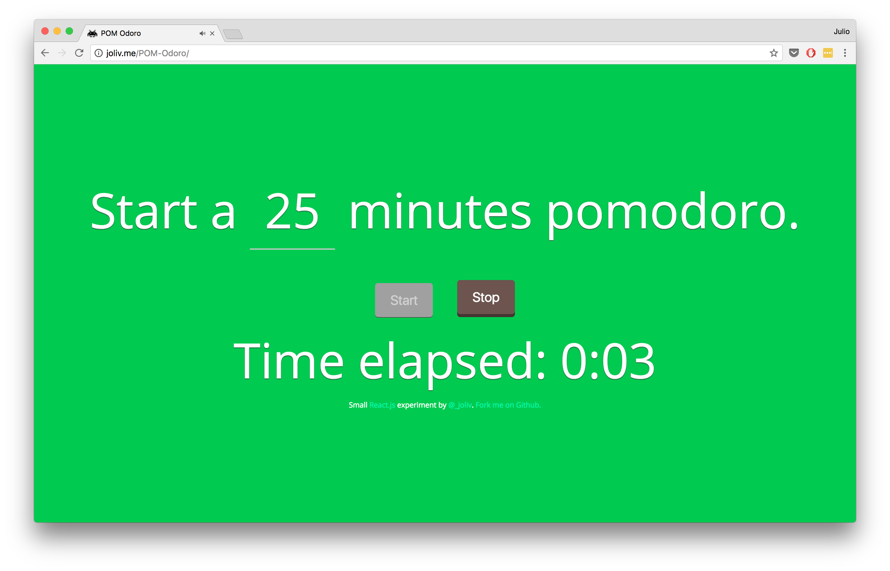
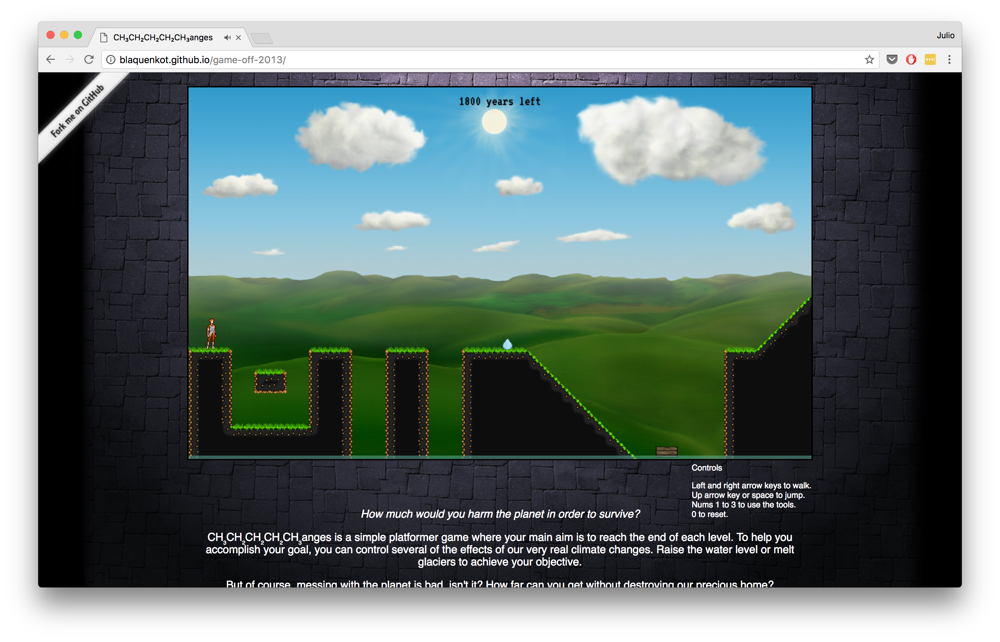

+++
+++

# [rlox](https://rlox-wasm.now.sh/)

Lox interpreter from
[Crafting Interpreters](http://www.craftinginterpreters.com/) written in Rust
and compiled to WebAssembly.

# [Interval Practice](https://julioolvr.github.io/interval-practice/)

Tool to learn and practice intervals between musical notes

# [POM-Odoro](https://julioolvr.github.io/POM-Odoro/)

Small timer to follow the
[Pomodoro Technique](https://en.wikipedia.org/wiki/Pomodoro_Technique)

# [CH₃CH₂CH₂CH₂CH₃anges](http://blaquenkot.github.io/game-off-2013/)

Game for [Github's Game Off II](https://github.com/blog/1674-github-game-off-ii)

